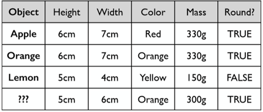

[<<< Previous](installation.md) | [Next >>>](data.md)

# What Is Classification? 

Let's show an example of classification using fruit!

## Example: Fruit

How would you describe apples to a computer?  How would they differ from oranges?

Remember, computers can only really understand numbers, true false values, and strings within a predefined set


Source: Andrew Rosenberg

Our fruit test shows us everything we need to do a classification machine learning test. For each item with a *label* (apple, orange, lemon), we use a series of values to try to capture machine-understandable information about the item.  These values are a *feature representation* of the item in question.  The features themselves, as we can see above, can be numeric, true/false values, or a string in a set of predefined strings.

## What if we had a new, unknown fruit?



Source: Andrew Rosenberg

Our fruit test is an example of a *classification* task.  Classification allows you to predict a *categorical* value.  This is a type of *supervised* machine learning, meaning we know the labels ahead of time and can give them to the machine learning algorithm so that it can be trained to knows what the categories of our data are.  This way, when it comes time to give the previously algorithm previously unseen data, it knows which categories it's looking for.


## Getting Our Data

Let's get to coding!

We are going to *classify* two different sets of sentences from very different source material in the Brown corpus: one set of sentences from a corpus of news text, and the other set of sentences from a corpus of romance novel text. 

```python
from nltk.corpus import brown
```

For a list of categories in the Brown corpus, use the following code

```python
for cat in brown.categories():
    print (cat)
```

    adventure
    belles_lettres
    editorial
    fiction
    government
    hobbies
    humor
    learned
    lore
    mystery
    news
    religion
    reviews
    romance
    science_fiction
    

## Get the sentences from each corpus


```python
news_sent = brown.sents(categories=["news"])
romance_sent = brown.sents(categories=["romance"])
```

## Take a look at the first 5 sentences in each corpus 


```python
print(news_sent[:5])
print()
print(romance_sent[:5])

```

    [['The', 'Fulton', 'County', 'Grand', 'Jury', 'said', 'Friday', 'an', 'investigation', 'of', "Atlanta's", 'recent', 'primary', 'election', 'produced', '``', 'no', 'evidence', "''", 'that', 'any', 'irregularities', 'took', 'place', '.'], ['The', 'jury', 'further', 'said', 'in', 'term-end', 'presentments', 'that', 'the', 'City', 'Executive', 'Committee', ',', 'which', 'had', 'over-all', 'charge', 'of', 'the', 'election', ',', '``', 'deserves', 'the', 'praise', 'and', 'thanks', 'of', 'the', 'City', 'of', 'Atlanta', "''", 'for', 'the', 'manner', 'in', 'which', 'the', 'election', 'was', 'conducted', '.'], ['The', 'September-October', 'term', 'jury', 'had', 'been', 'charged', 'by', 'Fulton', 'Superior', 'Court', 'Judge', 'Durwood', 'Pye', 'to', 'investigate', 'reports', 'of', 'possible', '``', 'irregularities', "''", 'in', 'the', 'hard-fought', 'primary', 'which', 'was', 'won', 'by', 'Mayor-nominate', 'Ivan', 'Allen', 'Jr.', '.'], ['``', 'Only', 'a', 'relative', 'handful', 'of', 'such', 'reports', 'was', 'received', "''", ',', 'the', 'jury', 'said', ',', '``', 'considering', 'the', 'widespread', 'interest', 'in', 'the', 'election', ',', 'the', 'number', 'of', 'voters', 'and', 'the', 'size', 'of', 'this', 'city', "''", '.'], ['The', 'jury', 'said', 'it', 'did', 'find', 'that', 'many', 'of', "Georgia's", 'registration', 'and', 'election', 'laws', '``', 'are', 'outmoded', 'or', 'inadequate', 'and', 'often', 'ambiguous', "''", '.']]
    
    [['They', 'neither', 'liked', 'nor', 'disliked', 'the', 'Old', 'Man', '.'], ['To', 'them', 'he', 'could', 'have', 'been', 'the', 'broken', 'bell', 'in', 'the', 'church', 'tower', 'which', 'rang', 'before', 'and', 'after', 'Mass', ',', 'and', 'at', 'noon', ',', 'and', 'at', 'six', 'each', 'evening', '--', 'its', 'tone', ',', 'repetitive', ',', 'monotonous', ',', 'never', 'breaking', 'the', 'boredom', 'of', 'the', 'streets', '.'], ['The', 'Old', 'Man', 'was', 'unimportant', '.'], ['Yet', 'if', 'he', 'were', 'not', 'there', ',', 'they', 'would', 'have', 'missed', 'him', ',', 'as', 'they', 'would', 'have', 'missed', 'the', 'sounds', 'of', 'bees', 'buzzing', 'against', 'the', 'screen', 'door', 'in', 'early', 'June', ';', ';'], ['or', 'the', 'smell', 'of', 'thick', 'tomato', 'paste', '--', 'the', 'ripe', 'smell', 'that', 'was', 'both', 'sweet', 'and', 'sour', '--', 'rising', 'up', 'from', 'aluminum', 'trays', 'wrapped', 'in', 'fly-dotted', 'cheesecloth', '.']]
    

## What do you notice about the format of the data above?
Each sentence is already *tokenized* - split into a series of word and punctuation stringes, with whitespace removed. This saves us the time of having to do all of this work ourselves!

# Using Data Structures
To start to organize our data, let's put these sentences into a pandas *DataFrame*, an object which has a format very similar to an Excel spreadsheet.  We will first make two spread sheets (one for news, and one for romance), and then combine them into one.  We will also add the category each sentences came from, which will be our *labels* for each sentence and its associated feature representation (which we will build ourselves).


```python
ndf = pd.DataFrame({'sentence': news_sent,
                    'label':'news'})
rdf = pd.DataFrame({'sentence':romance_sent, 
                    'label':'romance'})
```


```python
# combining two spreadsheets into 1
df = pd.concat([ndf, rdf])
```

Let's see what this DataFrame looks like! Let print out the first 5 rows using `.head()`:

```python
df.head()
```
~~~
~~~

<div>
<style>
    .dataframe thead tr:only-child th {
        text-align: right;
    }

    .dataframe thead th {
        text-align: left;
    }

    .dataframe tbody tr th {
        vertical-align: top;
    }
</style>
<table border="1" class="dataframe">
  <thead>
    <tr style="text-align: right;">
      <th></th>
      <th>label</th>
      <th>sentence</th>
    </tr>
  </thead>
  <tbody>
    <tr>
      <th>0</th>
      <td>news</td>
      <td>[The, Fulton, County, Grand, Jury, said, Frida...</td>
    </tr>
    <tr>
      <th>1</th>
      <td>news</td>
      <td>[The, jury, further, said, in, term-end, prese...</td>
    </tr>
    <tr>
      <th>2</th>
      <td>news</td>
      <td>[The, September-October, term, jury, had, been...</td>
    </tr>
    <tr>
      <th>3</th>
      <td>news</td>
      <td>[``, Only, a, relative, handful, of, such, rep...</td>
    </tr>
    <tr>
      <th>4</th>
      <td>news</td>
      <td>[The, jury, said, it, did, find, that, many, o...</td>
    </tr>
  </tbody>
</table>
</div>


### So how many labels do we have?


```python
df['label'].value_counts()
```


    news       4623
    romance    4431
    Name: label, dtype: int64


## What if we want to visualize that information?
We first create a `figure` and `axes` on which to draw our charts using `plt.subplots()`. Each chart is one axes, and a figure can contain multiple charts. Our data is encapsulated in `df['label'].value_counts()`, which is itself a dataframe. We then tell the Pandas to visualize the dataframe as a bar chart using `.plot.bar(ax=ax, rot=0)`. The `ax` keyword tells Pandas which chart in the figure to plot, and the `rot` keyword controls the rotation of the x axis labels.

```python
fig, ax = plt.subplots()
_ = df['label'].value_counts().plot.bar(ax=ax, rot=0)
fig.savefig("images/categories_counts.png", bbox_inches = 'tight', pad_inches = 0)
```


We have slightly more news data than romance data, which we should keep in mind as we go ahead with classification.


[<<< Previous](installation.md) | [Next >>>](data.md)
