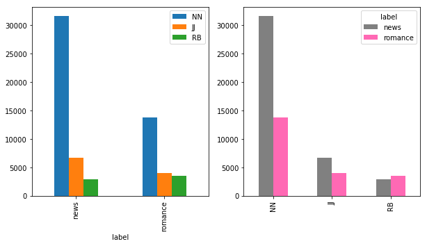

# Extracting Features
## What should we use as features for our data set?  What did we use as features for our fruit example before?


## Now that we are using sentences, how can we best repersent each sentence as a series of values?

One idea is to use how many particular *parts of speech* the sentence contains.

- Nouns: Most basically described as a person, place, or thing.  Counting nouns can help determine how many topics are being discussed in a sentence.
- Adjectives: Descriptors of nouns (eg. "yellow", "angry", "charming").  Counting adjectives can help determine how often descriptive words are being added to nouns, which can demonstrate writing style.
- Adverbs: Descriptors of verbs (eg. "quickly", "hungrily", "annoyingly").  Counting adverbs can help determine how often the manner of the verb is modified, which can also demonstrate writing style.


We will now compute all of the parts of speech on each sentence (row) in our dataframe.


```python
# compute parts of speech on each sentence (row)
pos_all = pos_tag_sents(df['sentence'])
```


```python
print (pos_all[:5])
```

    [[('The', 'DT'), ('Fulton', 'NNP'), ('County', 'NNP'), ('Grand', 'NNP'), ('Jury', 'NNP'), ('said', 'VBD'), ('Friday', 'NNP'), ('an', 'DT'), ('investigation', 'NN'), ('of', 'IN'), ("Atlanta's", 'NNP'), ('recent', 'JJ'), ('primary', 'JJ'), ('election', 'NN'), ('produced', 'VBD'), ('``', '``'), ('no', 'DT'), ('evidence', 'NN'), ("''", "''"), ('that', 'IN'), ('any', 'DT'), ('irregularities', 'NNS'), ('took', 'VBD'), ('place', 'NN'), ('.', '.')], [('The', 'DT'), ('jury', 'NN'), ('further', 'RB'), ('said', 'VBD'), ('in', 'IN'), ('term-end', 'JJ'), ('presentments', 'NNS'), ('that', 'IN'), ('the', 'DT'), ('City', 'NNP'), ('Executive', 'NNP'), ('Committee', 'NNP'), (',', ','), ('which', 'WDT'), ('had', 'VBD'), ('over-all', 'JJ'), ('charge', 'NN'), ('of', 'IN'), ('the', 'DT'), ('election', 'NN'), (',', ','), ('``', '``'), ('deserves', 'VBZ'), ('the', 'DT'), ('praise', 'NN'), ('and', 'CC'), ('thanks', 'NNS'), ('of', 'IN'), ('the', 'DT'), ('City', 'NNP'), ('of', 'IN'), ('Atlanta', 'NNP'), ("''", "''"), ('for', 'IN'), ('the', 'DT'), ('manner', 'NN'), ('in', 'IN'), ('which', 'WDT'), ('the', 'DT'), ('election', 'NN'), ('was', 'VBD'), ('conducted', 'VBN'), ('.', '.')], [('The', 'DT'), ('September-October', 'NNP'), ('term', 'NN'), ('jury', 'NN'), ('had', 'VBD'), ('been', 'VBN'), ('charged', 'VBN'), ('by', 'IN'), ('Fulton', 'NNP'), ('Superior', 'NNP'), ('Court', 'NNP'), ('Judge', 'NNP'), ('Durwood', 'NNP'), ('Pye', 'NNP'), ('to', 'TO'), ('investigate', 'VB'), ('reports', 'NNS'), ('of', 'IN'), ('possible', 'JJ'), ('``', '``'), ('irregularities', 'NNS'), ("''", "''"), ('in', 'IN'), ('the', 'DT'), ('hard-fought', 'JJ'), ('primary', 'NN'), ('which', 'WDT'), ('was', 'VBD'), ('won', 'VBN'), ('by', 'IN'), ('Mayor-nominate', 'NNP'), ('Ivan', 'NNP'), ('Allen', 'NNP'), ('Jr.', 'NNP'), ('.', '.')], [('``', '``'), ('Only', 'RB'), ('a', 'DT'), ('relative', 'JJ'), ('handful', 'NN'), ('of', 'IN'), ('such', 'JJ'), ('reports', 'NNS'), ('was', 'VBD'), ('received', 'VBN'), ("''", "''"), (',', ','), ('the', 'DT'), ('jury', 'NN'), ('said', 'VBD'), (',', ','), ('``', '``'), ('considering', 'VBG'), ('the', 'DT'), ('widespread', 'JJ'), ('interest', 'NN'), ('in', 'IN'), ('the', 'DT'), ('election', 'NN'), (',', ','), ('the', 'DT'), ('number', 'NN'), ('of', 'IN'), ('voters', 'NNS'), ('and', 'CC'), ('the', 'DT'), ('size', 'NN'), ('of', 'IN'), ('this', 'DT'), ('city', 'NN'), ("''", "''"), ('.', '.')], [('The', 'DT'), ('jury', 'NN'), ('said', 'VBD'), ('it', 'PRP'), ('did', 'VBD'), ('find', 'VB'), ('that', 'IN'), ('many', 'JJ'), ('of', 'IN'), ("Georgia's", 'NNP'), ('registration', 'NN'), ('and', 'CC'), ('election', 'NN'), ('laws', 'NNS'), ('``', '``'), ('are', 'VBP'), ('outmoded', 'VBN'), ('or', 'CC'), ('inadequate', 'JJ'), ('and', 'CC'), ('often', 'RB'), ('ambiguous', 'JJ'), ("''", "''"), ('.', '.')]]
    

## What's with those part of speech labels?  They aren't helpful at all!
The Penn Tagset, which NLTK uses for it's part of speech tagger, is not particularly intuitive.  Fortunately, they provide code that allows you to check what different tags stand for.


```python
nltk.help.upenn_tagset("NN")
nltk.help.upenn_tagset("JJ")
nltk.help.upenn_tagset("RB")
```

    NN: noun, common, singular or mass
        common-carrier cabbage knuckle-duster Casino afghan shed thermostat
        investment slide humour falloff slick wind hyena override subhumanity
        machinist ...
    JJ: adjective or numeral, ordinal
        third ill-mannered pre-war regrettable oiled calamitous first separable
        ectoplasmic battery-powered participatory fourth still-to-be-named
        multilingual multi-disciplinary ...
    RB: adverb
        occasionally unabatingly maddeningly adventurously professedly
        stirringly prominently technologically magisterially predominately
        swiftly fiscally pitilessly ...
    

## Write a function that calculates our features for us 
### (In this case, numbers of nouns, adjectives, and adverbs that appear in the sentence)

Now we know the tags for the different parts of speech we want to count in each sentence.  Let's now write a function that will count the parts of speech to us, when given a part of speech tagged sentence (such as we have already in our DataFrame) and the part of speech we want to count (for example, "NN" to count the number of nouns in the sentence).


```python
def countPOS(pos_tag_sent, POS):
    pos_count = 0
    all_pos_counts = []
    for sentence in pos_tag_sent:
        for word in sentence:
            tag = word[1]
            if tag [:2] == POS:  
                pos_count = pos_count+1
        all_pos_counts.append(pos_count)
        pos_count = 0
    return all_pos_counts
```

We will now call this function three different times, one for each of the parts of speech we are counting.  As we finish counting them, we put the results into the DataFrame, saving us the trouble of having to do so later.


```python
df['NN'] = countPOS(pos_all, 'NN')
df['JJ'] = countPOS(pos_all, "JJ")
df['RB'] = countPOS(pos_all, "RB")
```


```python
df.head()
```


<div>
<style>
    .dataframe thead tr:only-child th {
        text-align: right;
    }

    .dataframe thead th {
        text-align: left;
    }

    .dataframe tbody tr th {
        vertical-align: top;
    }
</style>
<table border="1" class="dataframe">
  <thead>
    <tr style="text-align: right;">
      <th></th>
      <th>label</th>
      <th>sentence</th>
      <th>NN</th>
      <th>JJ</th>
      <th>RB</th>
    </tr>
  </thead>
  <tbody>
    <tr>
      <th>0</th>
      <td>news</td>
      <td>[The, Fulton, County, Grand, Jury, said, Frida...</td>
      <td>11</td>
      <td>2</td>
      <td>0</td>
    </tr>
    <tr>
      <th>1</th>
      <td>news</td>
      <td>[The, jury, further, said, in, term-end, prese...</td>
      <td>13</td>
      <td>2</td>
      <td>1</td>
    </tr>
    <tr>
      <th>2</th>
      <td>news</td>
      <td>[The, September-October, term, jury, had, been...</td>
      <td>16</td>
      <td>2</td>
      <td>0</td>
    </tr>
    <tr>
      <th>3</th>
      <td>news</td>
      <td>[``, Only, a, relative, handful, of, such, rep...</td>
      <td>9</td>
      <td>3</td>
      <td>1</td>
    </tr>
    <tr>
      <th>4</th>
      <td>news</td>
      <td>[The, jury, said, it, did, find, that, many, o...</td>
      <td>5</td>
      <td>3</td>
      <td>1</td>
    </tr>
  </tbody>
</table>
</div>


```python
df.tail()
```


<div>
<style>
    .dataframe thead tr:only-child th {
        text-align: right;
    }

    .dataframe thead th {
        text-align: left;
    }

    .dataframe tbody tr th {
        vertical-align: top;
    }
</style>
<table border="1" class="dataframe">
  <thead>
    <tr style="text-align: right;">
      <th></th>
      <th>label</th>
      <th>sentence</th>
      <th>NN</th>
      <th>JJ</th>
      <th>RB</th>
    </tr>
  </thead>
  <tbody>
    <tr>
      <th>4426</th>
      <td>romance</td>
      <td>[Nobody, else, showed, pleasure, .]</td>
      <td>2</td>
      <td>0</td>
      <td>1</td>
    </tr>
    <tr>
      <th>4427</th>
      <td>romance</td>
      <td>[Spike-haired, ,, burly, ,, red-faced, ,, deck...</td>
      <td>9</td>
      <td>3</td>
      <td>1</td>
    </tr>
    <tr>
      <th>4428</th>
      <td>romance</td>
      <td>[``, Hello, ,, boss, '', ,, he, said, ,, and, ...</td>
      <td>2</td>
      <td>0</td>
      <td>0</td>
    </tr>
    <tr>
      <th>4429</th>
      <td>romance</td>
      <td>[``, I, suppose, I, can, never, expect, to, ca...</td>
      <td>3</td>
      <td>0</td>
      <td>1</td>
    </tr>
    <tr>
      <th>4430</th>
      <td>romance</td>
      <td>[``, I'm, afraid, not, '', .]</td>
      <td>1</td>
      <td>0</td>
      <td>1</td>
    </tr>
  </tbody>
</table>
</div>


## How many features do we have?


```python
df.groupby('label').sum()
```


<div>
<style>
    .dataframe thead tr:only-child th {
        text-align: right;
    }

    .dataframe thead th {
        text-align: left;
    }

    .dataframe tbody tr th {
        vertical-align: top;
    }
</style>
<table border="1" class="dataframe">
  <thead>
    <tr style="text-align: right;">
      <th></th>
      <th>NN</th>
      <th>JJ</th>
      <th>RB</th>
    </tr>
    <tr>
      <th>label</th>
      <th></th>
      <th></th>
      <th></th>
    </tr>
  </thead>
  <tbody>
    <tr>
      <th>news</th>
      <td>31593</td>
      <td>6678</td>
      <td>2935</td>
    </tr>
    <tr>
      <th>romance</th>
      <td>13821</td>
      <td>4022</td>
      <td>3570</td>
    </tr>
  </tbody>
</table>
</div>


## Let's visualize this data!
What do you notice about the data when we look visualize it?  Do you think our features will be good at predicting news and romance sentences?  Which features do you think will be the most useful?


```python
fig, (ax1,ax2) = plt.subplots(ncols=2,  figsize=(10,5))
_ = df.groupby('label').sum().plot.bar(ax=ax1)
_ = df.groupby('label').sum().T.plot.bar(ax=ax2, color=['gray','hotpink'])

```





## Save the dataframe to your computer as a csv file (comma separated value)


```python
df.to_csv("FilePath")
```
