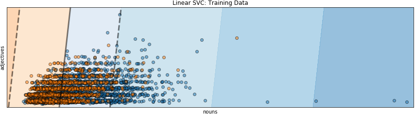
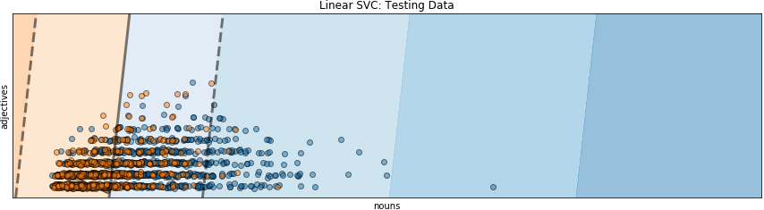

[<<< Previous](supervised.md) | [Next >>>](unsupervised.md)

# Supervised Classification Algorithm with sklearn!


One of the best things about sklearn is the simplicity of its syntax.

To do machine learning with sklearn, follow these three steps (the function names remain the same, regardless of the classifier you use!):

## Step 1:  Import your desired classifier


```python
from sklearn.svm import LinearSVC
```

## Step 2: Create an instance of your machine learning algorithm


```python
classifier = LinearSVC()
```

## Step 3:  Fit your data to your classifier (train)

```python
classifier.fit(X_train, y_train)
```
```output
 LinearSVC(C=1.0, class_weight=None, dual=True, fit_intercept=True,
         intercept_scaling=1, loss='squared_hinge', max_iter=1000,
         multi_class='ovr', penalty='l2', random_state=None, tol=0.0001,
         verbose=0)
```
As mentioned above, LinearSVC, which is a linear model for classification that separates classes using a line, a plane, or a hyperplane. The `classifier.fit` method searches for that line, plane, or hyperplane-which is also called the decision boundary. The dark gray line in the figure below is the decision boundary that the *LinearSVC* classifier found for this set of training data. All the data (dots) to the left of the gray line in the area with the orange background are classified as romance, while all the data to the right in the blue area are classified as news. The leftward skew of the classification space is due to the data being very dense and highly overlapping.



 ## Step 4: predict labels for unseen data (test)
```python
y_predict = classifier.predict(X_test)
```


## Step 5: score!
Evaluate the skill of the model by computing the 
* score: how many predicted labels are the same as the actual labels 
* confusion matrix: true positive, false positive, false negative, and true negative counts

```python
classifier.score(X_test, y_test)
```
```output
0.70759717314487636
```


Right now, our classifier can correctly predict previously unseen news and data about 71% of the time.  We can get more information about how we doing by creating a confusion matrix. This confusion matrix shows how many times we are predicting categories correctly.


```python
from sklearn.metrics import confusion_matrix
```


```python
confusion_matrix(y_test, y_predict)
confusion_matrix
```

|      |actual news | actual romance |
|:--: | :--:| :--:|
|predicted news | 747 | 409 |
|predicted romance|253 | 855|

In `LinearSVC` the `classifier.predict` decides which class a data point is in based on which side of the decision boundary, which is the gray line in the figure, the point falls on. Points in the orange area to the left of the gray line are classified as romance, while points in the blue area to the right of the gray line. Orange points in the blue area are romance texts that are misclassified as news texts, while blue points in the orange area are news texts that are misclassified as romance texts. 



[<<< Previous](supervised.md) | [Next >>>](unsupervised.md)
