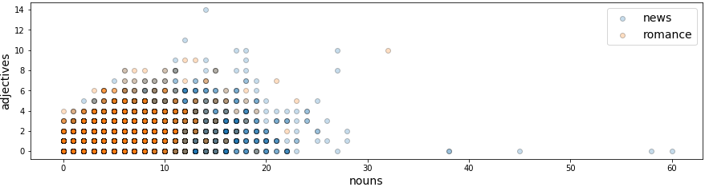
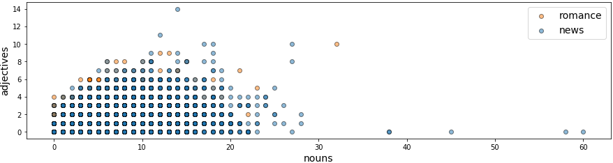
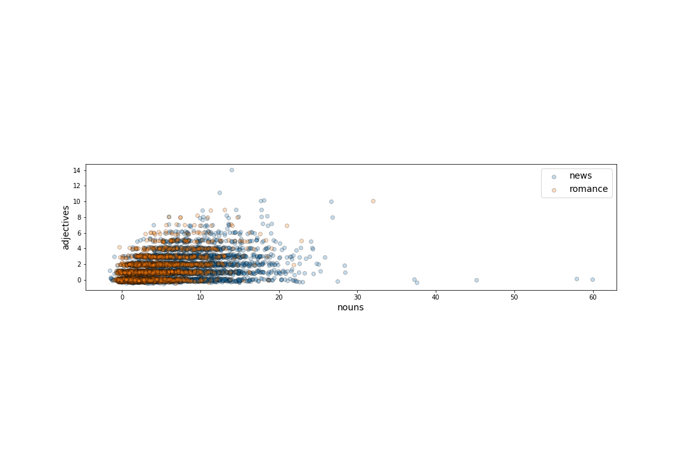

[<<< Previous](features.md) | [Next >>>](supervised.md)

## Let's visualize this data!
What do you notice about the data?  Do you think our features will be good at predicting news and romance sentences?  Which features do you think will be the most useful? We will be using the *matplotlib* and *pandas* libraries to visualize our data, and the latter is built on the former. As mentioned above, a *matplotlib* visualization is a `figure` onto which is attached one or more `axes`. Each `axis` has a horizontal (x) `axis` and vertical (y) `axis`, and the data is encoded using color and glyphs such as `markers` (for example circles) or `lines` or polygons (called `patches`). The figure below annotates these parts of a visualization and was created by Nicolas P. Rougier using `matplotlib`. The source code can be found in the matplotlib documentation. <sup>1</sup>

<sup>1</sup>https://matplotlib.org/gallery/showcase/anatomy.html#sphx-glr-gallery-showcase-anatomy-py

### How do we visualize the table of parts of speech?

We can directly plot any dataframe in pandas using the `.plot` method, and can do `.plot.<type>` to denote the type of chart we want to plot. This situation calls for a bar chart because there are two classes of discrete sums of counts. To explore a different grouping, the table can be rotated using `.T` (transpose). 


```python
fig, (ax1,ax2) = plt.subplots(ncols=2,  figsize=(15,5))
_ = df.groupby('label').sum().plot.bar(ax=ax1, rot=0, color=['blue', 'red'])
_ = df.groupby('label').sum().T.plot.bar(ax=ax2, color=['tab:blue','tab:orange'], rot=0)

fig.savefig("images/part_of_speech.png", bbox_inches = 'tight', pad_inches = 0)
```


### Are there patterns in the individual observations?

We can make a scatter plot of our data colored by label to see if the patterns observed in the aggregate are visible in the individual observations.


```python
# seperate our data into the two classes
news = df[df['label']=='news']
romance = df[df['label']=='romance']

fig, ax = plt.subplots(figsize=(15,10))
_ = ax.scatter(news['NN'], news['JJ'], label="news", alpha=.25, edgecolor='k')
_ = ax.scatter(romance['NN'], romance['JJ'], label="romance", alpha=.25, edgecolor='k')
_ = ax.legend(fontsize=14)
_ = ax.set_xlabel("nouns", fontsize=14)
_ = ax.set_ylabel("adjectives", fontsize=14)
_ = ax.set_aspect("equal")
fig.savefig("images/news_scatter.png", bbox_inches = 'tight', pad_inches = 0)
```





```python
# Let's flip the order
fig, ax = plt.subplots(figsize=(15,10))
_ = ax.scatter(romance['NN'], romance['JJ'], label="romance", color='tab:orange', alpha=.5, edgecolor='k')
_ = ax.scatter(news['NN'], news['JJ'], label="news", color='tab:blue', alpha=.5, edgecolor='k')
_ = ax.legend(fontsize=14)
_ = ax.set_xlabel("nouns", fontsize=14)
_ = ax.set_ylabel("adjectives", fontsize=14)
_ = ax.set_aspect("equal")
fig.savefig("images/romance_scatter.png", bbox_inches = 'tight', pad_inches = 0)
```





### How do we visualize dense, highly overlapping data? 

As seen above, when the data is very dense the points can sometimes overlap. One way to visualize this overlapping data is to shift each point by a tiny amount so that the data is no longer at exactly the same coordinate. This technique is called *jittering*. In the `jitter` function below, we compute a scale factor by which to multiply random numbers between 0 and 1 so that the jitter is large enough to effect the visualization. 


```python
np.random.seed(42)

def jitter(arr):
    scale = .01*(arr.min() - arr.max())
    return arr + np.random.randn(arr.shape[0]) * scale

fig, ax = plt.subplots(figsize=(15,10))

_ = ax.scatter(jitter(news['NN']), jitter(news['JJ']), label="news", alpha=.25, edgecolor='k')
_ = ax.scatter(jitter(romance['NN']), jitter(romance['JJ']), label="romance", alpha=.25, edgecolor='k')
_ = ax.legend(fontsize=14)
_ = ax.set_xlabel("nouns", fontsize=14)
_ = ax.set_ylabel("adjectives", fontsize=14)
_ = ax.set_aspect("equal")
fig.savefig("images/jitter.png", bbox_inches = 'tight', pad_inches = 0)

```




### Visualize Side By Side
Lets put the scatter plot next to the bar chart aggregated comparisons so that we can see how our overall patterns compare to what is happening in the individual observations. 

```python
fig, (ax1, ax2) = plt.subplots(ncols=2, figsize=(15,3), gridspec_kw={'width_ratios':[1,5]})

_ = df.groupby('label').sum().T.plot.bar(ax=ax1, color=['tab:blue','tab:orange'], rot=0, 
                                         fontsize=14)
ax1.set_ylabel("Total Count of POS")

_ = ax2.scatter(jitter(news['NN']), jitter(news['JJ']), label="news", alpha=.25, edgecolor='k')
_ = ax2.scatter(jitter(romance['NN']), jitter(romance['JJ']), label="romance", alpha=.25, edgecolor='k')
_ = ax2.legend(fontsize=14)
_ = ax2.set_xlabel("nouns", fontsize=14)
_ = ax2.set_ylabel("adjectives", fontsize=14)
_ = ax2.set_aspect('equal')
fig.savefig("images/side_by_side.png", bbox_inches = 'tight', pad_inches = 0)
```


[<<< Previous](features.md) | [Next >>>](supervised.md)

